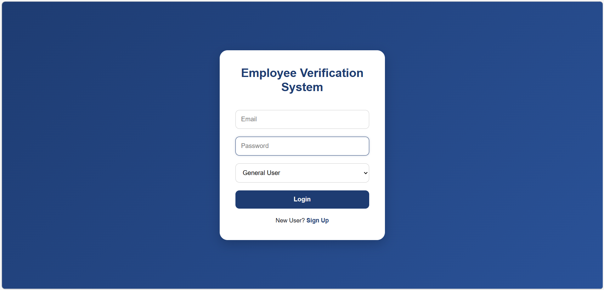
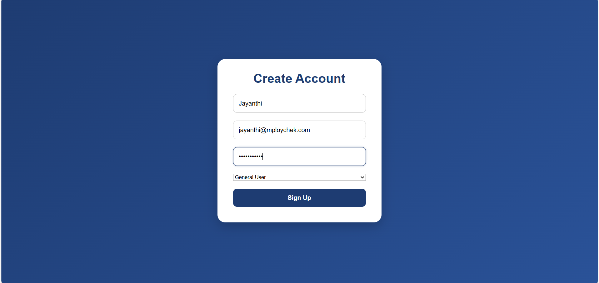
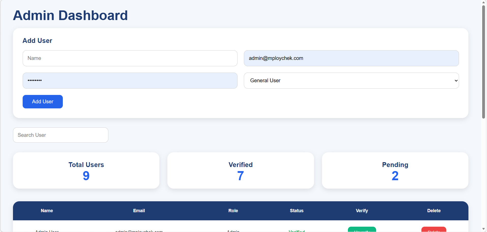
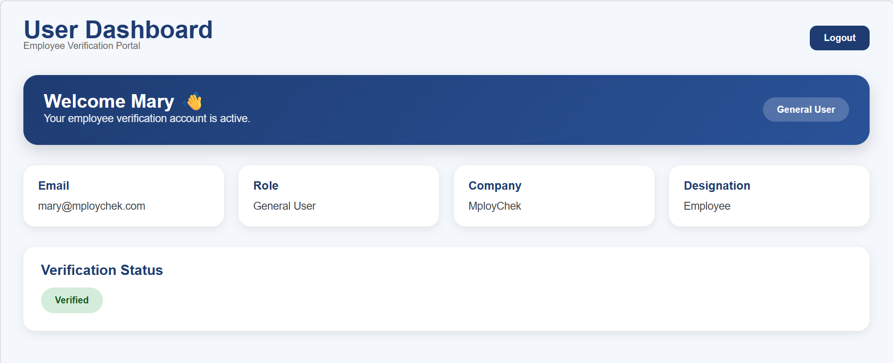
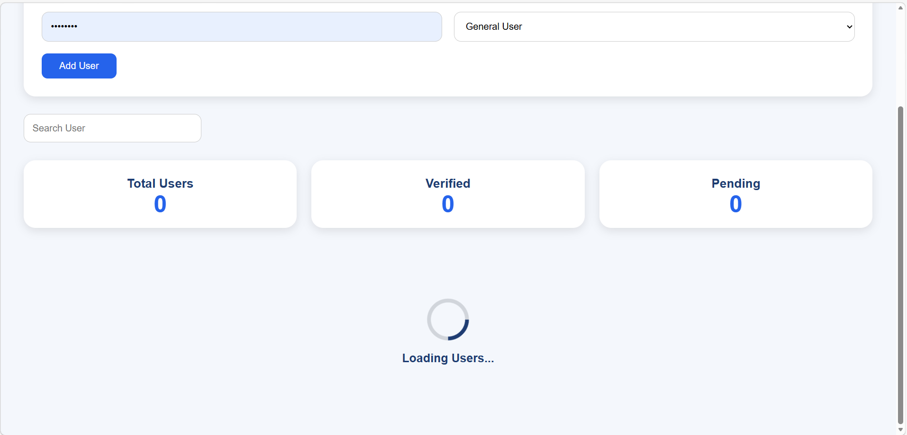

# Employee Verification System

A Full Stack Employee Verification System built using Angular, Node.js, Express, and MongoDB.

This application provides secure role-based authentication and employee verification management for Admin and General Users.

---

# Features

## Authentication
- User Signup
- User Login
- JWT Authentication
- Route Guards
- Role-Based Access Control

---

# User Roles

## Admin
Admin users can:

- View all users
- Add new users
- Verify / Unverify users
- Delete users
- Search users
- Monitor verification status

---

## General User
General users can:

- Login securely
- View personal dashboard
- View profile information
- View verification status

---

# Async Processing

The application demonstrates asynchronous API handling using:

- Simulated API delay using `setTimeout()`
- Dynamic loading spinner
- Angular HttpClient Observables

---

# Technologies Used

## Frontend
- Angular
- TypeScript
- Angular Material
- HTML5
- SCSS

## Backend
- Node.js
- Express.js
- MongoDB
- Mongoose
- JWT
- bcryptjs

---

# Project Architecture

```bash
Employee-Verification-System
│
├── frontend
│   ├── src
│   ├── pages
│   ├── services
│   ├── guards
│
├── backend
│   ├── controllers
│   ├── models
│   ├── routes
│
└── README.md
```

---

# API Endpoints

## Authentication

| Method | Endpoint | Description |
|--------|----------|-------------|
| POST | `/api/auth/register` | Register User |
| POST | `/api/auth/login` | Login User |
| GET | `/api/auth/users` | Get All Users |
| PUT | `/api/auth/verify/:id` | Verify User |
| DELETE | `/api/auth/delete/:id` | Delete User |

---

# Installation Guide

## Clone Repository

```bash
git clone YOUR_GITHUB_REPO_LINK
```

---

# Backend Setup

```bash
cd backend
npm install
npm run dev
```

---

# Frontend Setup

```bash
cd frontend
npm install
ng serve
```

Frontend runs on:

```bash
http://localhost:4200
```

Backend runs on:

```bash
http://localhost:5000
```

---

# Environment Variables

Create a `.env` file inside backend folder.

```env
PORT=5000
MONGO_URI=YOUR_MONGODB_CONNECTION
JWT_SECRET=YOUR_SECRET_KEY
```

---

# Application Workflow

1. User signs up
2. User logs in with role
3. Route guard validates access
4. Admin manages users
5. Verification updates dynamically
6. User dashboard reflects verification status

---

# Screenshots

# Screenshots

## Login Page


## Signup page


## Admin Dashboard



## User Dashboard


## Loading Spinner

---

# Future Enhancements

- Email Verification
- Forgot Password
- Pagination
- Dashboard Charts
- Deployment
- Dark Mode

---

# Author

## Sneha Sivakumar

MCA Student  
AI Developer Enthusiast
Full Stack Developer Enthusiast


---

# License

This project is developed for educational and academic purposes.